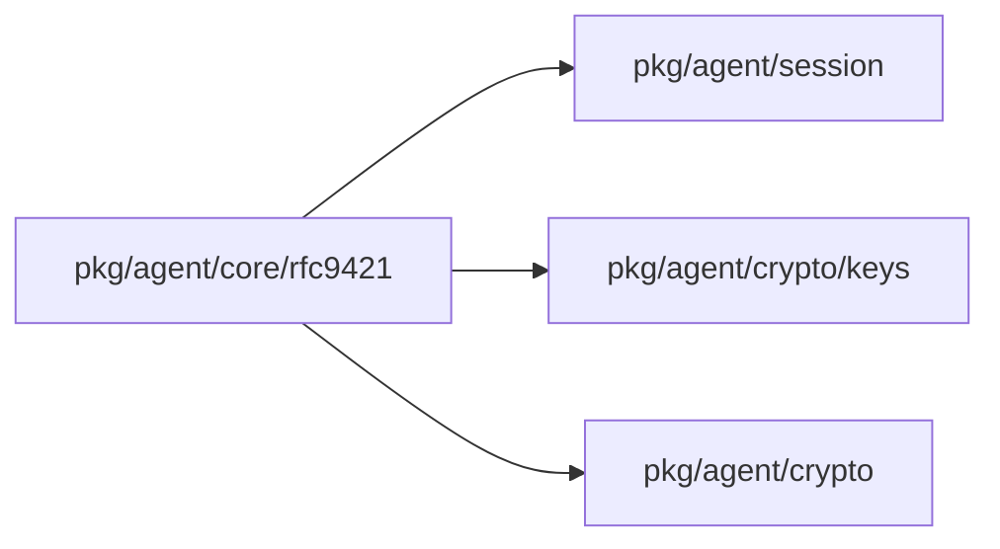
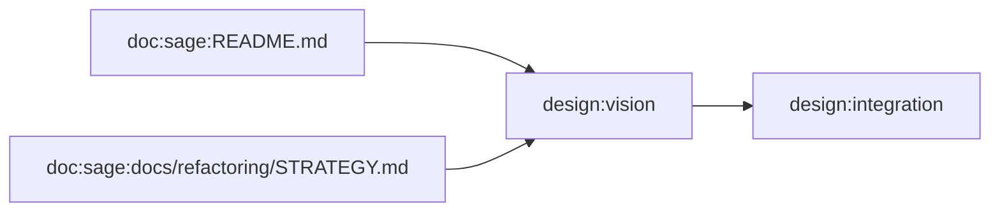
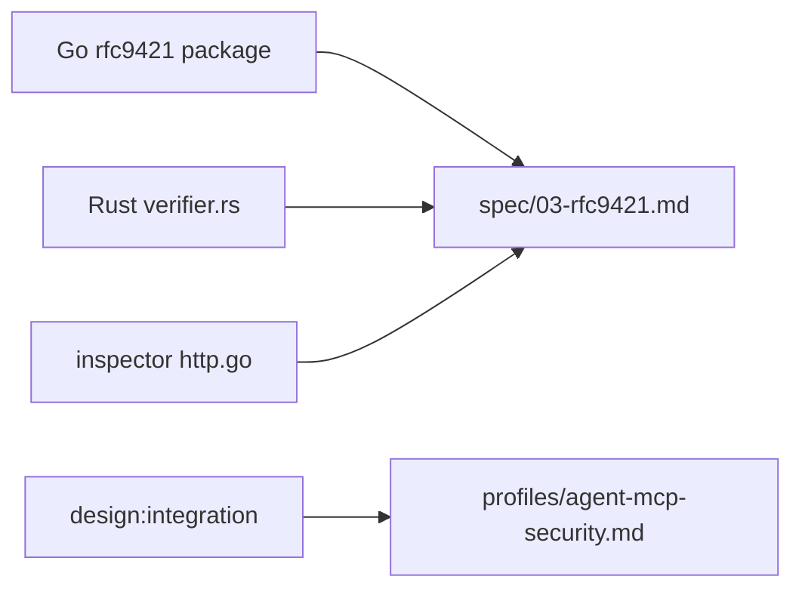

# SAGE evidence graphs

Status: 2026-09-13 analysis for protocol 0.10.0. This inventory is not security proof or certification.

## Scope and method

All **161 git-tracked sage Markdown files** were rescanned from current contents for headings, hashes and package mentions, including archives and analysis outputs. Untracked `contracts/`, dependencies and untracked files are excluded. X-bar is an organizational analogy, not a linguistic parser: head = topic, type = document role, specifier = audience, complement = discussed packages, adjunct = language/archive/content anchors.

Historical classifications from `docs/refactoring/DOCS_GRAPH.md` and `docs/refactoring/v2/review/01-documentation-graph.md` cover 143 paths; the remaining 18 use current headings/path. Original rows and line anchors are retained. Audiences are inferred; complements are current literal package-path mentions, not evidence that a document agrees with code. Historical freshness verdicts are **not** promoted to current correctness. Every document carries `not_fully_claim_revalidated`. Earlier 139/105-document counts describe different dates/scopes.

The existing AST tool was executed without source modifications:

```sh
cd /Users/0xtopaz/work/github/sage-x-project/sage/tools/codegraph
go run . -dir /Users/0xtopaz/work/github/sage-x-project/sage -out /private/tmp/sage-ast-current
```

It returned **58 packages, 1,777 symbols and 1,722 edges**: 112 imports, 1,473 calls, 55 references, 19 embeds, 63 implements. No package-load warning appeared. Toolchain: Go 1.26.0, darwin/arm64. `go/packages` loads syntax and types with `Tests=false`; test-file counts are metadata only. Host build constraints apply. Nested Go modules, non-Go code, Rust AST and dynamic/reflection behavior are excluded. Selected generated bindings, examples and integration packages are included; this is not a core-only count.

The tool emitted 119 undeclared edge endpoints, represented as `ast_reference_only` without invented symbol locations. It also reuses two `init` IDs for 7 and 12 declarations; normalized symbol nodes retain all declarations, and their call edges cannot be attributed to a particular init body. `raw_ast_graph` preserves the original object including these limitations. Directory-empty package paths are retained as `.`.

## Machine-readable schema

[graphs.json](graphs.json), schema `sage-evidence-graph/1`, contains `repositories`, `scope`, `command`, `counts`, normalized `nodes`/`edges`, and original `raw_ast_graph`.

- Node IDs: `doc:<repo>:<path>`, `go:<qualified-name>`, `source:<repo>:<path>`, `design:<concept>`. They are unique and stable across line changes. Each declaration has repository/commit/path/one-based line; reference-only nodes identify extractor provenance, not a declaration. Design anchors explicitly use working-draft Seed provenance.
- Evidence: `observed_ast`, `observed_ast_reference`, `observed_document_link`, `observed_source_read`, or `semantic_inferred`. Method-set implementation edges do not prove actual runtime usage.
- Edge fields: `id/from/to/kind/evidence`, optional `basis`. ID = first 24 SHA-256 hex characters of sorted JSON edge content excluding ID; duplicates are collapsed. Every endpoint resolves. `declares` comes from the tool's symbol-package field.
- Document `xbar`: `head/type/specifier/complement/adjuncts`; type is SPEC/GUIDE/REFERENCE/RATIONALE/STATUS/INDEX. Adjuncts retain full heading list and SHA-256. `lineage` stores the original review row and source.

## Selected projections

Code-view arrows below are observed package imports. Purpose-view arrows are semantic interpretations and are present as such in JSON. These are selected views, not all symbols.





## Specification mapping projection

The JSON includes `doc:sage-spec:<chapter>` working-draft nodes and `implementation_scope_candidate` edges from existing packages. These are **responsibility mappings**, not statements that existing code satisfies 0.10.0. The current source graph is pinned; concurrently edited specification nodes intentionally have working-draft provenance. `design:integration` maps to `profiles/agent-mcp-security.md` through `specified_by`. Rust/inspector source anchors similarly identify candidate verification scope without implying conformance.



## Current X-bar inventory

Every row corresponds to `doc:sage:<path>` in JSON, which supplies complements, audience, adjuncts and provenance. A document's classification does not confer normative authority. Archive text remains historical.

| Path | Head | Type |
|---|---|---|
| `.github/PULL_REQUEST_TEMPLATE.md` | Pull Request | GUIDE |
| `CHANGELOG.md` | Changelog | STATUS |
| `CODE_OF_CONDUCT.md` | Contributor Covenant Code of Conduct | RATIONALE |
| `CONTRIBUTING.md` | Contributing to SAGE | GUIDE |
| `INSTALL.md` | SAGE Installation and Build Instructions | GUIDE |
| `README.md` | SAGE - Secure Agent Guarantee Engine | INDEX |
| `SECURITY.md` | Security Policy | GUIDE |
| `api/README.md` | SAGE API Specification | REFERENCE |
| `api/examples/authentication.md` | SAGE Authentication Example | GUIDE |
| `api/examples/sessions.md` | SAGE Session Management Example | GUIDE |
| `api/examples/signatures.md` | SAGE HTTP Signatures Example (RFC 9421) | GUIDE |
| `deployments/README.md` | SAGE Deployment Configurations | GUIDE |
| `deployments/docker/README.md` | SAGE Docker Deployment | GUIDE |
| `docs/AGENTCARD_MIGRATION_GUIDE.md` | AgentCardRegistry Migration Guide | GUIDE |
| `docs/API.md` | SAGE API Documentation | REFERENCE |
| `docs/ARCHITECTURE.md` | SAGE Architecture | RATIONALE |
| `docs/BUILD.md` | SAGE Build Guide | GUIDE |
| `docs/CI-CD.md` | SAGE CI/CD Pipeline | REFERENCE |
| `docs/CODE_REVIEW_CHECKLIST.md` | SAGE Code Review Checklist | GUIDE |
| `docs/CODING_GUIDELINES.md` | SAGE Coding Guidelines | GUIDE |
| `docs/DATABASE.md` | SAGE Database Documentation | GUIDE |
| `docs/GO_VERSION_REQUIREMENT.md` | Go Version Requirements | REFERENCE |
| `docs/INDEX.md` | SAGE Documentation Index | INDEX |
| `docs/KME_PUBLIC_KEY_INTEGRATION.md` | KME Public Key Integration Documentation | STATUS |
| `docs/PERFORMANCE_BENCHMARKS.md` | AgentCardRegistry Performance Benchmarks | STATUS |
| `docs/QUICKSTART_PR118.md` | Quick Start Guide: PR #118 Security Enhancements | GUIDE |
| `docs/adr/001-transport-layer-abstraction.md` | ADR-001: Transport Layer Abstraction | RATIONALE |
| `docs/adr/002-hpke-selection-rationale.md` | ADR-002: HPKE Selection for End-to-End Encryption | RATIONALE |
| `docs/adr/003-did-method-selection.md` | ADR-003: DID Method Selection for Agent Identity | RATIONALE |
| `docs/archive/2026-09/SAGE_A2A_INTEGRATION_GUIDE.md` | SAGE-A2A Integration Guide | GUIDE |
| `docs/archive/2026-09/audit/ARCHITECTURE-OVERVIEW.md` | SAGE Architecture Overview | RATIONALE |
| `docs/archive/2026-09/audit/AUDIT-SCOPE.md` | SAGE Security Audit Scope | STATUS |
| `docs/archive/2026-09/audit/README.md` | SAGE Security Audit Package | STATUS |
| `docs/archive/2026-09/audit/SECURITY-CONSIDERATIONS.md` | SAGE Security Considerations | RATIONALE |
| `docs/archive/2026-09/contracts/contracts-submodule-setup.md` | Setting Up SAGE Contracts as Git Submodule | GUIDE |
| `docs/archive/2026-09/dev/README.md` | SAGE (Secure Agent Guarantee Engine) | RATIONALE |
| `docs/archive/2026-09/dev/api-spec.md` | SAGE API 명세서 | REFERENCE |
| `docs/archive/2026-09/dev/architecture.md` | SAGE 아키텍처 문서 | RATIONALE |
| `docs/archive/2026-09/dev/development-guide.md` | SAGE 개발 가이드 | GUIDE |
| `docs/archive/2026-09/maintenance/DOCUMENTATION_AUDIT_2025-10-26.md` | Documentation Audit Report | STATUS |
| `docs/archive/2026-09/planning/PERFORMANCE_OPTIMIZATION_ROADMAP.md` | SAGE 성능 최적화 로드맵 | STATUS |
| `docs/archive/2026-09/test/LOAD-TESTING.md` | SAGE Load Testing Guide | GUIDE |
| `docs/archive/2026-09/test/OPTIMIZATION-PLAN.md` | SAGE Performance Optimization Plan | STATUS |
| `docs/archive/2026-09/test/PERFORMANCE-BASELINE.md` | SAGE Performance Baseline Report | STATUS |
| `docs/archive/2026-09/test/TEST_EXECUTION_GUIDE.md` | SAGE Complete Test Execution Guide | GUIDE |
| `docs/cli/cli-guide-en.md` | SAGE CLI Tools Documentation | REFERENCE |
| `docs/cli/cli-guide-ko.md` | SAGE CLI 도구 문서 | REFERENCE |
| `docs/contracts/ERC-8004-Analysis.md` | EIP-8004 (ERC-8004): Trustless Agents 상세 분석 리포트 | RATIONALE |
| `docs/contracts/SAGE-vs-ERC8004-Comparison.md` | SAGE vs ERC-8004: 핵심 차이점 분석 | RATIONALE |
| `docs/contracts/SOLIDITY_CONTRACTS_ANALYSIS.md` | SAGE Smart Contracts Analysis | REFERENCE |
| `docs/core/README.md` | Core Package Documentation | INDEX |
| `docs/core/rfc-9421-test.md` | RFC-9421 HTTP Message Signatures - 테스트 계획 및 상태 | STATUS |
| `docs/core/rfc9421-en.md` | RFC-9421 HTTP Message Signatures | REFERENCE |
| `docs/core/rfc9421-ko.md` | RFC-9421 HTTP 메시지 서명 | REFERENCE |
| `docs/crypto/crypto-en.md` | SAGE Crypto Package | REFERENCE |
| `docs/crypto/crypto-ko.md` | SAGE Crypto Package | REFERENCE |
| `docs/dev/SAGE-secure-session-communication-ko.md` | Secure Session Communication | SPEC |
| `docs/dev/security-design.md` | SAGE 보안 설계서 | RATIONALE |
| `docs/did/did-en.md` | SAGE DID Package | GUIDE |
| `docs/did/did-ko.md` | SAGE DID Package | GUIDE |
| `docs/handshake/README-ko.md` | SAGE 핸드셰이크 문서 | INDEX |
| `docs/handshake/README.md` | SAGE Handshake Documentation | INDEX |
| `docs/handshake/cryptographic-en.md` | Cryptographic | RATIONALE |
| `docs/handshake/cryptographic-ko.md` | Cryptographic | RATIONALE |
| `docs/handshake/handshake-en.md` | SAGE Handshake Package | GUIDE |
| `docs/handshake/handshake-ko.md` | SAGE Handshak Packae | GUIDE |
| `docs/handshake/hpke-based-handshake-en.md` | SAGE HPKE-based Handshake | GUIDE |
| `docs/handshake/hpke-based-handshake-ko.md` | SAGE HPKE-based Handshake | GUIDE |
| `docs/handshake/hpke-detailed-ko.md` | HPKE 핸드셰이크 메커니즘 상세 설명 (코드 기반) | GUIDE |
| `docs/overview/DETAILED_GUIDE_PART1_KO.md` | SAGE 프로젝트 상세 가이드 - Part 1: 프로젝트 개요 및 아키텍처 | GUIDE |
| `docs/overview/DETAILED_GUIDE_PART2_KO.md` | SAGE 프로젝트 상세 가이드 - Part 2: 암호화 시스템 Deep Dive | GUIDE |
| `docs/overview/DETAILED_GUIDE_PART3_KO.md` | SAGE 프로젝트 상세 가이드 - Part 3: DID 및 블록체인 통합 | GUIDE |
| `docs/overview/DETAILED_GUIDE_PART4_KO.md` | SAGE 프로젝트 상세 가이드 - Part 4: HPKE 기반 핸드셰이크 프로토콜 및 세션 관리 | GUIDE |
| `docs/overview/DETAILED_GUIDE_PART5_KO.md` | SAGE 프로젝트 상세 가이드 - Part 5: 스마트 컨트랙트 및 온체인 레지스트리 | GUIDE |
| `docs/overview/DETAILED_GUIDE_PART6A_KO.md` | SAGE 프로젝트 상세 가이드 - Part 6A: 완전한 데이터 플로우 | GUIDE |
| `docs/overview/DETAILED_GUIDE_PART6B_KO.md` | SAGE 프로젝트 상세 가이드 - Part 6B: 실전 통합 가이드 | GUIDE |
| `docs/overview/DETAILED_GUIDE_PART6C_KO.md` | SAGE 프로젝트 상세 가이드 - Part 6C: 문제 해결 및 모범 사례 | GUIDE |
| `docs/refactoring/BACKLOG.md` | SAGE improvement backlog | STATUS |
| `docs/refactoring/DECISIONS.md` | Refactoring decisions (proposal, 2026-09-11) | RATIONALE |
| `docs/refactoring/DOCS_GRAPH.md` | SAGE Documentation Graph (X-bar classification) | STATUS |
| `docs/refactoring/FEATURE_MAP.md` | SAGE feature map (from entry points) | STATUS |
| `docs/refactoring/PR_LOG.md` | Dependency PR verification log (2026-09-11) | STATUS |
| `docs/refactoring/README.md` | docs/refactoring | INDEX |
| `docs/refactoring/REFACTORING_DESIGN.md` | SAGE Refactoring Design | RATIONALE |
| `docs/refactoring/SECURITY_WIRING_AUDIT.md` | Security Wiring Audit — actual request paths | STATUS |
| `docs/refactoring/STRATEGY.md` | SAGE strategy proposal: protocol-first, multi-repository, deterministic | RATIONALE |
| `docs/refactoring/SUPPLY_CHAIN_AUDIT.md` | SAGE Supply-Chain, CI, Release and Version-Management Audit | STATUS |
| `docs/refactoring/analysis/01-crypto.md` | Architecture Analysis: `pkg/agent/crypto/**` and `internal/cryptoinit` | STATUS |
| `docs/refactoring/analysis/02-did-blockchain-config.md` | DID Layer Architecture Analysis (read-only) | STATUS |
| `docs/refactoring/analysis/03-handshake-hpke-session-transport.md` | Architecture Analysis: handshake / hpke / session / transport / internal (sessioninit) | STATUS |
| `docs/refactoring/analysis/04-core-storage-health-oidc-internal.md` | Architecture Analysis: core / rfc9421 / message / storage / health / oidc / version / logger / metrics | STATUS |
| `docs/refactoring/analysis/05-cmd-lib-tests-sdk-contracts-ci.md` | SAGE Peripheral Architecture Analysis (cmd, lib, tests, tools, examples, sdk, contracts, build/CI) | STATUS |
| `docs/refactoring/graph/entrypoints.md` | Entry points and feature reachability | REFERENCE |
| `docs/refactoring/graph/summary.md` | Code Graph Summary | REFERENCE |
| `docs/refactoring/v2/LICENSING.md` | Licence review (2026-09-12) | RATIONALE |
| `docs/refactoring/v2/README.md` | docs/refactoring/v2 | INDEX |
| `docs/refactoring/v2/REPO_PLAN.md` | Repository plan (final, 2026-09-12) | RATIONALE |
| `docs/refactoring/v2/REPO_STRUCTURE_OPTIONS.md` | Repository structure options | RATIONALE |
| `docs/refactoring/v2/RS_SAGE_CORE_ALIGNMENT.md` | rs-sage-core alignment plan (F-03) | STATUS |
| `docs/refactoring/v2/VERSION_POLICY.md` | Cross-repository version policy (F-06) | STATUS |
| `docs/refactoring/v2/review/01-documentation-graph.md` | Documentation graph, second pass (X-bar classification) | STATUS |
| `docs/refactoring/v2/review/02-code-graph.md` | 02. Code graph of main (AST-based) | STATUS |
| `docs/refactoring/v2/review/03-history-timeline.md` | 03. History timeline: how SAGE and its documentation evolved | STATUS |
| `docs/refactoring/v2/review/04-purpose-and-vision.md` | 04. Purpose and vision: what SAGE says it is for | RATIONALE |
| `docs/refactoring/v2/review/05-progress-assessment.md` | 05. Progress assessment: where SAGE stands against its purpose and protocol | STATUS |
| `docs/refactoring/v2/review/06-direction-and-stack-evaluation.md` | 06. Direction and stack evaluation: does the chosen technology fit the purpose? | STATUS |
| `docs/refactoring/v2/review/07-literature-review.md` | 07. Literature review: where SAGE sits in the research landscape | STATUS |
| `docs/refactoring/v2/review/08-implementation-evaluation.md` | 08. Implementation evaluation against common practice (2026-09-12) | STATUS |
| `docs/refactoring/v2/review/09-protocol-flows.md` | 09. SAGE protocol flows as implemented (protocol overview) | STATUS |
| `docs/refactoring/v2/review/10-inspector-test-matrix.md` | 10. Conformance inspector test matrix | STATUS |
| `docs/refactoring/v2/review/11-repository-split-and-research-plan.md` | 11. Repository split and research plan | RATIONALE |
| `docs/refactoring/v2/review/12-did-standards-research.md` | 12. Decentralised identifier standards: what SAGE should build on | RATIONALE |
| `docs/refactoring/v2/review/13-revocation-research.md` | 13. Revocation research: what "immediate" can mean, and how other systems get there | RATIONALE |
| `docs/refactoring/v2/review/14-registry-coupling-analysis.md` | 14. Registry coupling: what is tied to Ethereum and what decoupling costs | RATIONALE |
| `docs/refactoring/v2/review/15-identity-and-registry-design.md` | Identity and registry: design proposal | RATIONALE |
| `docs/refactoring/v2/review/README.md` | Project review (2026-09-12) | INDEX |
| `docs/test/FUZZING.md` | SAGE Fuzzing Guide | GUIDE |
| `docs/test/GO_TEST_COMMANDS.md` | Go 테스트 명령어 모음 | REFERENCE |
| `docs/test/SPECIFICATION_VERIFICATION_MATRIX.md` | SAGE 명세서 검증 매트릭스 | STATUS |
| `docs/test/TESTING.md` | SAGE Testing Guide | GUIDE |
| `docs/test/TESTING_GUIDE.md` | SAGE Testing Guide | GUIDE |
| `docs/test/sage-cli-commands-copy-paste.md` | SAGE CLI 명령어 - 복사 붙여넣기 버전 | GUIDE |
| `docs/test/sections/SECTION_1_RFC9421.md` | 1. RFC 9421 구현 | STATUS |
| `docs/test/sections/SECTION_2_CRYPTO.md` | 2. 암호화 키 관리 | STATUS |
| `docs/test/sections/SECTION_3_DID.md` | 3. DID 관리 | STATUS |
| `docs/test/sections/SECTION_4_BLOCKCHAIN.md` | 4. 블록체인 연동 | STATUS |
| `docs/test/sections/SECTION_5_MESSAGE.md` | 5. 메시지 처리 | STATUS |
| `docs/test/sections/SECTION_6_CLI.md` | 6. CLI 도구 | STATUS |
| `docs/test/sections/SECTION_7_SESSION.md` | 7. 세션 관리 | STATUS |
| `docs/test/sections/SECTION_8_HPKE.md` | 8. HPKE | STATUS |
| `docs/test/sections/SECTION_9_HEALTH.md` | 9. 헬스체크 | STATUS |
| `examples/README.md` | SAGE Examples | INDEX |
| `examples/a2a-integration/01-register-agent/README.md` | Example 01: Multi-Key Agent Registration | GUIDE |
| `examples/a2a-integration/02-generate-card/README.md` | Example 02: A2A Agent Card Generation | GUIDE |
| `examples/a2a-integration/03-exchange-cards/README.md` | Example 03: A2A Card Exchange and Verification | GUIDE |
| `examples/a2a-integration/04-secure-message/README.md` | Example 04: Secure Message Exchange | GUIDE |
| `examples/a2a-integration/README.md` | A2A Integration Examples | INDEX |
| `examples/agent-initialization/README.md` | SAGE Agent Initialization Examples | GUIDE |
| `examples/mcp-integration/QUICKSTART.md` | Quick Start Guide - MCP + SAGE Integration | GUIDE |
| `examples/mcp-integration/README.md` | MCP + SAGE Integration Examples | INDEX |
| `examples/mcp-integration/basic-demo/README.md` | Basic SAGE + MCP Demo | GUIDE |
| `examples/mcp-integration/simple-standalone/README.md` | Simple Standalone SAGE Integration Example | GUIDE |
| `examples/mcp-integration/vulnerable-vs-secure/README.md` | Vulnerable vs Secure AI Chat Example | GUIDE |
| `examples/simple-agent-init/README.md` | Simple Agent Initialization | GUIDE |
| `internal/sessioninit/README.md` | SessionInit Package | REFERENCE |
| `pkg/agent/crypto/README.md` | SAGE Cryptographic Operations | REFERENCE |
| `pkg/agent/did/README.md` | SAGE Decentralized Identity (DID) Management | REFERENCE |
| `pkg/agent/session/README.md` | SAGE Session Management | REFERENCE |
| `pkg/agent/transport/README.md` | SAGE Transport Layer | REFERENCE |
| `pkg/agent/transport/http/README.md` | HTTP Transport for SAGE | REFERENCE |
| `pkg/agent/transport/websocket/README.md` | WebSocket Transport for SAGE | REFERENCE |
| `pkg/telemetry/logger/README.md` | Logger Package | REFERENCE |
| `pkg/telemetry/metrics/README.md` | Metrics Package | REFERENCE |
| `scripts/test/README_VERIFICATION.md` | SAGE Specification Verification Script | GUIDE |
| `sdk/java/sage-client/README.md` | SAGE Java Client | REFERENCE |
| `sdk/python/README.md` | SAGE Python Client | REFERENCE |
| `sdk/rust/sage-client/README.md` | SAGE Rust Client | REFERENCE |
| `sdk/typescript/README.md` | SAGE TypeScript SDK | REFERENCE |
| `tools/benchmark/README.md` | SAGE Performance Benchmarks | GUIDE |
| `tools/loadtest/README.md` | SAGE Load Testing | GUIDE |
| `tools/scripts/README_VERSION.md` | Version Update Script | GUIDE |

## Source commits

| Repository | Commit | Worktree at capture |
|---|---|---|
| sage | `c7709b7486e0da94336edc0931fddd87f6a45343` | `?? contracts/` |
| sage-spec | `f4a4e7fbf71a665785984eef7609b2e8fabe833d` | `?? seeds/` |
| rs-sage-core | `206bbbb5a66667ae2feb3b0e9991ed1ca4622bb2` | `clean` |
| sage-inspector | `05b890d973cf3b62a82ba412462af746aa5c266d` | `clean` |

See [purpose and vision](purpose-and-vision.md) for claim-level source checks and [repository roles](../architecture/repository-roles.md) for proposed ownership. Sources were read only; analysis was assembled in a temporary specification staging directory.

## Normative trace overlay

The current graph also contains **45 requirement nodes, 77 rule groups and 386 planned cases**, linked from the working specification. These use `authored_normative_trace`, not `observed_ast`; they are design and planned verification rather than implementation evidence. Kinds `requirement`, `rule`, `case` and `draft_document` extend the documented node vocabulary. Edges `contains_rule`, `specified_by` and `planned_verification` link existing drafted document nodes to the [traceability plan](../verification/traceability.json).

Combined graph: **2626 nodes / 5189 edges**. Earlier AST and source-inventory counts above retain their narrower scope. All cases are `planned_not_executed`; no graph edge means a test passed.
