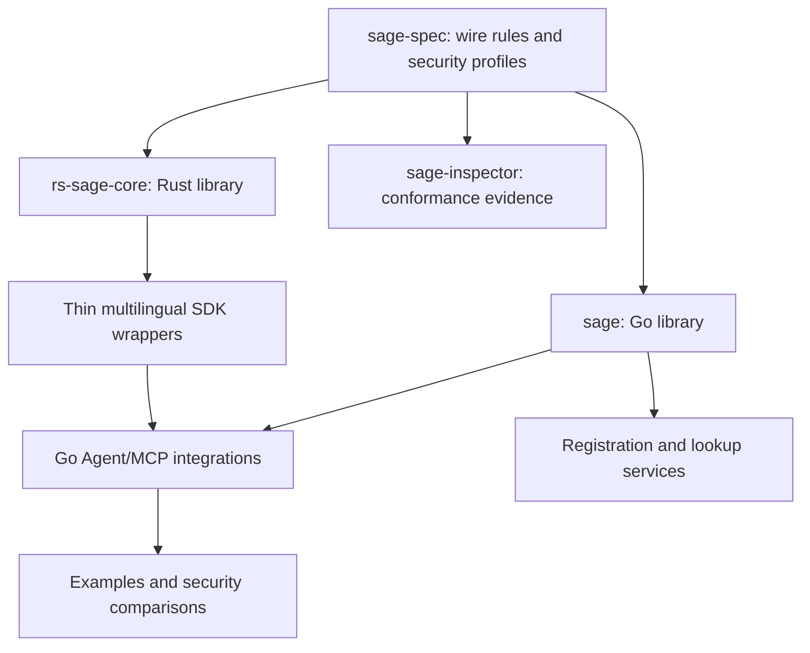

# Repository roles and dependency ownership

Status: proposed ownership design for protocol **0.10.0**. No repository was created, code moved, SDK implemented or service deployed in this work. The four source repositories and commits actually inspected are recorded in [graphs.json](../analysis/graphs.json). Other names below describe proposed destinations or roles, not verified new deployments.

## Authority and dependency direction

`sage-spec` owns wire formats, cryptographic profiles, identity/key lifecycle rules, integration security invariants and verification contracts. Go `sage` and Rust `rs-sage-core` are reusable libraries that implement those rules independently. Neither implementation fills specification gaps by becoming normative. Library release numbers remain independent of protocol 0.10.0; compatibility must declare the exact specification version/profile.

Consumers depend on libraries and profiles. Libraries must not depend on Agent UI, model-provider APIs, application approval policies, registry web applications, example programs or an inspector executable. Resolver/key-store/replay-store interfaces can be core contracts while network/database/platform adapters are supplied by callers. This is a **target dependency rule**, not a claim that every current Go package already satisfies it.

Arrows mean “supplies rules or reusable capabilities to”, not package imports. This design view is distinct from the observed AST imports in [graphs.md](../analysis/graphs.md).

## Ownership map

| Owner / proposed destination | Owns | Must not own | Current evidence / source mapping |
|---|---|---|---|
| `sage-spec` (existing) | Normative protocol, Agent/MCP security profile, threat boundaries, RFC rationale, compatibility definition, future vector definitions and formal-model specifications | Product SDK implementations, operational signing keys, live registry service state | Existing `spec/00–11`, charter, vectors; new analysis/profile/verification documents |
| `sage` (existing Go library) | Protocol primitives, encoding, HTTP signatures, HPKE, session records, DID/card primitives; typed extension contracts | Agent prompt policy and approval UI; hard-coded model-client lifecycle; wire behavior defined only by Go defaults | `pkg/agent/{core,crypto,did,hpke,session,transport}`, relevant `pkg/blockchain` adapters; explicit handling of deprecated `handshake` |
| `rs-sage-core` (existing Rust library) | Equivalent protocol logic, native Rust API, reviewed C ABI/WASM boundaries | Another independent protocol variant; SDKs reimplementing cryptographic canonicalization | `src/{rfc9421,hpke,session,jcs}`, `src/ffi`, `src/wasm`; current README aligns only with earlier draft |
| `sage-sdk-<language>` (**proposed names**) | Thin language bindings over a pinned core, idiomatic request/response wrappers, error/lifetime handling and middleware | New signature formats, alternative key schedules, automatic “trusted” labels for unverified traffic | Existing `sage/sdk/*` are migration inputs, not presumed compatible. Rust C ABI/WASM is preferred substrate where suitable; native Go consumers use Go directly. Choice is an implementation decision, not a wire requirement. |
| `sage-gateway` / Agent-MCP adapter role (existing name in historical plan; current code not inspected here) | Local/remote integration adapter and mandatory verification orchestration, caller context, protected signer access, failures returned before execution | LLM-optional verification masquerading as mandatory security; arbitrary signing requests from compromised Plugins | Seed/profile define required behavior; `sage/examples/mcp-integration/*` are examples to evaluate, not certified adapters |
| `sage-registry-service` (**proposed name**) | Agent/MCP registration workflow, discovery/query API, resolver caching with freshness/revocation policy, operational observability | Redefining DID/card wire semantics; trusting user-submitted metadata as code-integrity proof | Go DID/ethereum clients and existing registry chapters are inputs. Agent Card identity and MCP component/version descriptors need distinct ownership. An HTTP directory does not replace blockchain verification. |
| `sage-contracts` (name retained from prior repository plan; source checkout not included in this run) | Registry contracts, ABI/deployment records and contract-side transition tests | Go/Rust message verification or Agent local execution policy | `sage/pkg/blockchain/ethereum/contracts/agentcardregistry` is included as generated Go source; untracked `sage/contracts/` excluded |
| `sage-inspector` (existing) | Capture/vector inspection, expected-identity/policy inputs, verdict explanations and future cross-core differential tests | Production authorization enforcement by mere offline inspection; redefining normative acceptance rules | `pkg/inspect/http.go` read at pinned commit; current replay-disabled inspection needs distinct live/capture-set contracts |
| `sage-examples`, `sage-bench` (**proposed names**) | Runnable learning examples, matched SAGE/no-SAGE attack comparisons, reproducible result datasets and pinned version tuples | Claiming universal security from a successful demo; introducing a third protocol implementation | Current `sage/examples/mcp-integration/*`, benchmark/test assets are candidates; retain in place until migration gate passes |
| CLI/application owner (`sage-cli`, **proposed name**) | Commands, config, operator-facing errors, registration and inspection orchestration | Cryptographic implementations duplicated from core | Current `cmd/{sage-crypto,sage-did,sage-verify,sage-vectors}`, `internal/{app,cli,config}` |

## Trusted enforcement and MCP packaging

A MCP-exposed signing/verification facility is a delivery choice. The Client's protected execution logic must force validation before protected execution and before consuming a returned result. It must bind the actual execution target and bytes to the verified authorization and handle unavailable/verifier-timeout cases by refusal. A particular product's “hook” name is not a portable API contract.

Keys, policy/reference hashes, original-request storage and the enforcement implementation cannot reside solely in the mutable Plugin/MCP/Skill threat domain. A callable signer that blindly signs arbitrary Plugin requests is not a trusted authorization boundary. SDKs/adapters must expose the distinction between proposed operation, authorized execution envelope and verified result rather than return a single ambiguous success boolean.

Core primitives can report cryptographic validity; the Agent/MCP adapter supplies trusted intent, identity expectations, permission/resource context and mandatory invocation. Registration services supply independently verified identity state. Inspector records evidence; it does not replace the runtime enforcement point.

## Release ownership

Specification maintainers approve wire/profile changes. Core owners demonstrate clause/vector compatibility at pinned versions. SDK owners demonstrate FFI/middleware failure behavior and inherited core version. Service owners demonstrate registry transition, freshness and resolver failure policies. Inspector owners maintain independent verdict expectations. Example owners publish exact environment and source revisions for comparisons. These are role responsibilities, not assignments to named people.

A compatibility entry records specification/profile version, core revision, SDK/adapter revision, registry ABI/deployment context, test corpus revision, platform, and evidence state. No component may infer 0.10.0 conformance from an old draft tag or from package version alone.
